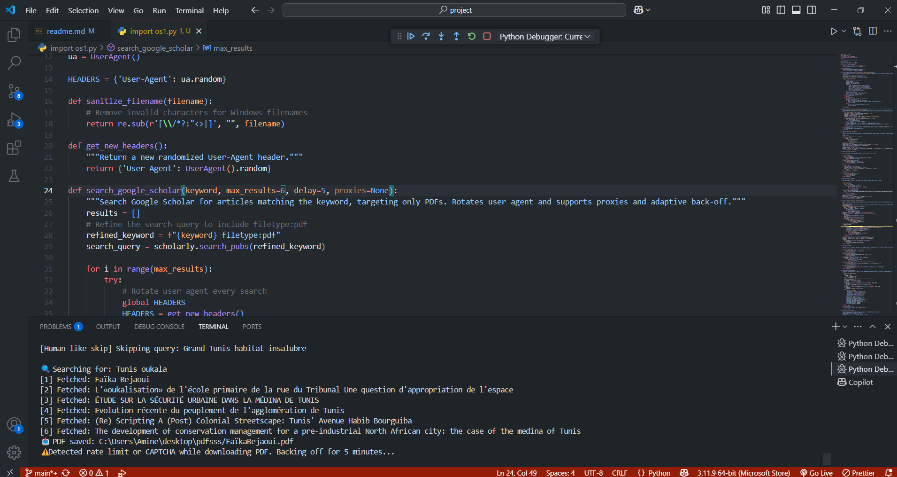
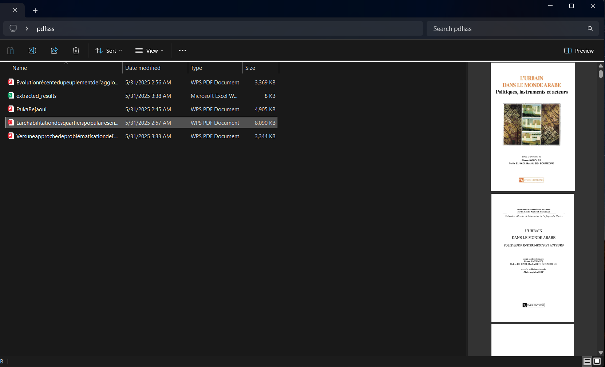
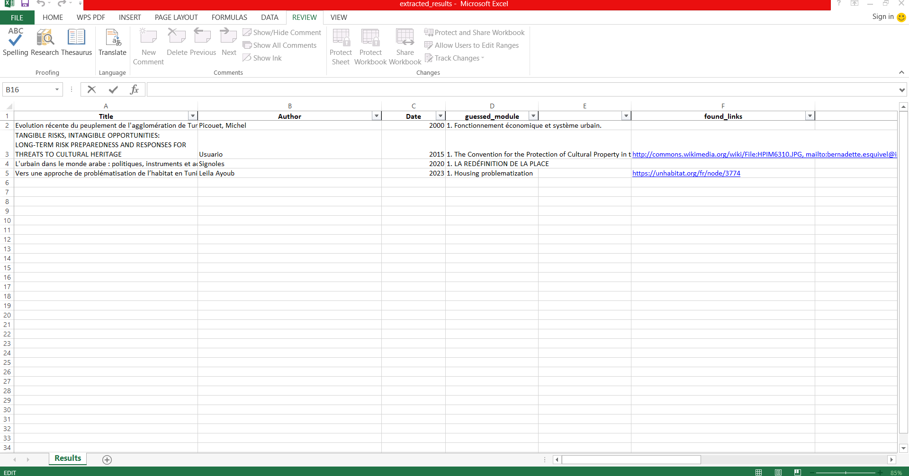

# Academic PDF Scraper & Metadata Extractor

## 📚 Table of Contents
- [Overview](#overview)
- [Features](#features)
- [Installation](#installation)
- [Usage](#usage)
- [Configuration](#configuration)
- [Output](#output)
- [Limitations](#limitations)
- [Roadmap](#roadmap)
- [Test Run Example](#test-run-example)

---

## Overview
This project automates the extraction of academic PDFs from Google Scholar, downloads the PDFs, extracts detailed metadata (including theme/module), and saves the results to a formatted Excel file. It is designed for research, academic, and professional use, supporting complex Boolean queries and robust PDF detection.

---

## Features
- **Automated Google Scholar Search:** Supports complex Boolean queries (AND/OR logic, parentheses, multi-word terms).
- **PDF Downloading:** Detects and downloads academic PDFs, with robust validation and duplicate prevention.
- **Metadata Extraction:** Extracts title, author, year, abstract, keywords, and advanced metadata (theme/module guessing using NLP and heuristics).
- **Excel Export:** Results are saved in a professional Excel file with autofilter, freeze panes, and easy-to-filter test flags.
- **Test Mode:** Per-query and global caps for safe testing; test results are flagged for easy deletion.
- **Human-like Behavior:** Randomized delays, query skipping, and back-off against CAPTHCA to reduce risk of blocking.

---

## Installation

1. **Clone or Download the Repository**
   ```
   git clone https://github.com/Aminehmida101/pdfscraper.git
   cd project
   ```
2. **Install Python Dependencies**
   - Requires Python 3.8+
   - Install dependencies:
   ```
   pip install -r requirements.txt
   ```
   - Key dependencies: `requests`, `PyMuPDF`, `pandas`, `xlsxwriter`, `scholarly`, `fake_useragent`, `scikit-learn` (optional)

---

## Usage

1. **Prepare Your Query**
   - Edit the `query_string` in `import os1.py` to match your research needs. Supports AND/OR logic, parentheses, and multi-word terms.
   - Example:
     ```python
     query_string = (
         '("Tunisie" OR "Tunis" OR "Grand Tunis") AND ("habitat anarchique" OR "habitat spontané")'
     )
     ```
2. **Run the Script**
   ```
   python "import os1.py"
   ```
   **Important:**
   - The script is set to extract a maximum of **50 PDFs per run** (`max_results=50`).
   - To change the locations or the extraction cap, edit the `folder_path`, `excel_path`, and `max_results` variables in `import os1.py`.
3. **Review Results**
   - Open `extracted_results.xlsx` for all extracted metadata.

## Configuration
- **max_results:** Global cap on total PDFs to download (set in `main()`, default: 50)
- **Proxies:** Set the `proxies` variable if you need to use a proxy server.
- **Output paths:** Change `folder_path` and `excel_path` in `import os1.py` to set custom output locations.

---

## Output
- **PDFs:** Downloaded to the specified folder (default: `C:\Users\Amine\desktop\pdfsss`).
- **Excel File:** All extracted metadata is saved to `extracted_results.xlsx` in the same folder.
- **Excel Columns:** Title, Authors, Year, Extracted Author, Extracted Year, Theme, Module, Abstract, Scholar Link, PDF URL, PDF Path, Links in PDF, Test Flag.
- **Test Flag:** Use this column to filter/delete test data from test runs.

---

## Limitations
- **Extraction Cap:** The script is hard-limited to extract a maximum of 50 PDFs per run (`max_results=50`).
  - *Solution:* To extract more, implement a proxy changer/rotator to avoid rate limits and blocking, or run the script multiple times with different proxies.

   IMPORTANT!!: if Proxy Rotator is available we can include parallel dowloads to make the extraction faster and make the delays low , and remove backing off when encoutering CAPTCHA or HTML 429
  

---

## Roadmap
- [ ] Add proxy rotation/changer for unlimited extraction
- [ ] Integrate OCR for scanned/image-based PDFs(for image pdfs)
- [ ] Advanced NLP for deeper semantic metadata extraction
- [ ] Manual review/approval workflow for production use
- [ ] Support for additional academic search APIs

---

## Test Run Example

This will search Google Scholar using the query:

```python
query_string = (
    '("Tunisie" OR "Tunis" OR "Grand Tunis" OR "tunisien" OR "Maghreb") '
    'AND ("habitat anarchique" OR "habitat spontané" OR "habitat non réglementaire" '
    'OR "habitat informel" OR "gourbiville" OR "bidonville" OR "habitat précaire" '
    'OR "habitat insalubre" OR "lotissement clandestin" OR "oukala" '
    'OR "Habitat spontané péri-urbain" OR "HSPU" OR "gourbi" OR "quartier informel" '
    'OR "quartier non réglementaire" OR "quartier anarchique")'
)
```

and download up to 50 PDFs, extract metadata, and save the results to Excel.

### Step 1: Run the Full Pipeline (Search)
```powershell
python import os1.py
```
searches 

<p align="center">
  
</p>

### Step 2: dowload pdfs and extract 

After the script finishes, checking output folder for the downloaded PDFs and the Excel file.


<p align="center">
  
</p>

### Step 3: Review the Excel File

Open `extracted_results.xlsx` to review the extracted metadata.


<p align="center">
  
</p>


---

